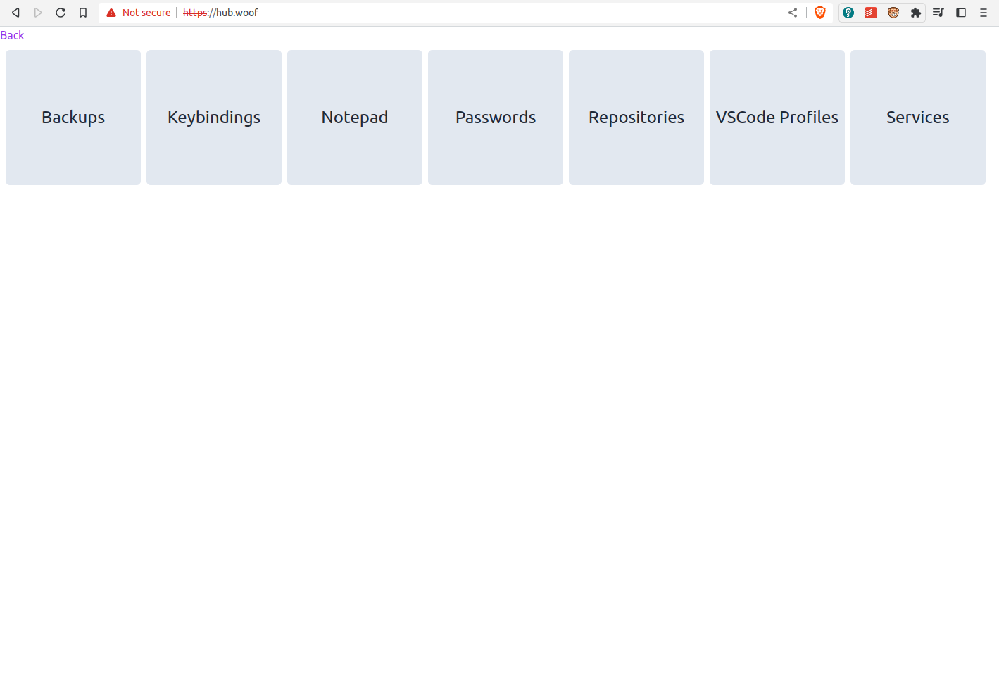

# hub

[Wo](https://github.com/hyperupcall/wo), [repomgr](https://github.com/hyperupcall/repomgr), and [dotmgr](https://github.com/hyperupcall/dotmgr) aren't as easy to use and iterate upon as I thought it would be.

This is a quick new rendition of the same idea - some central place to manage my *things*

